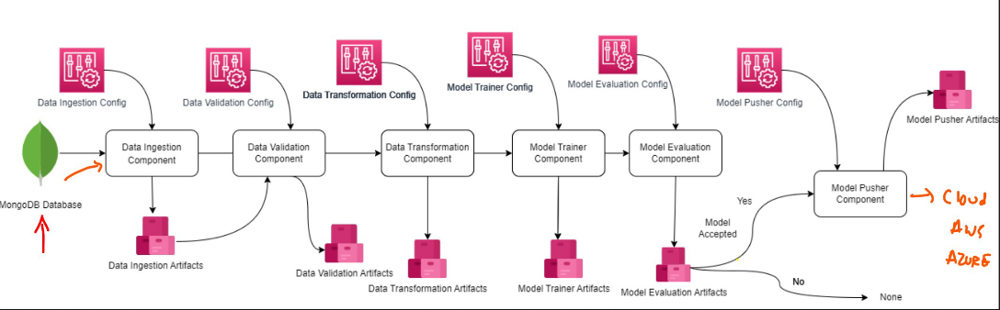
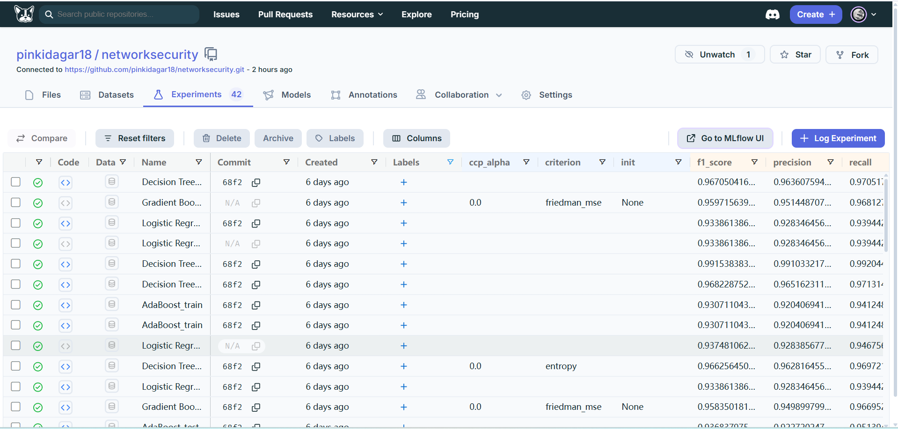
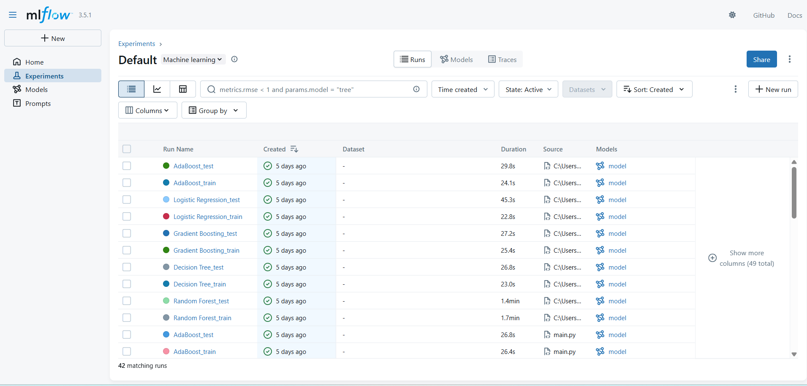
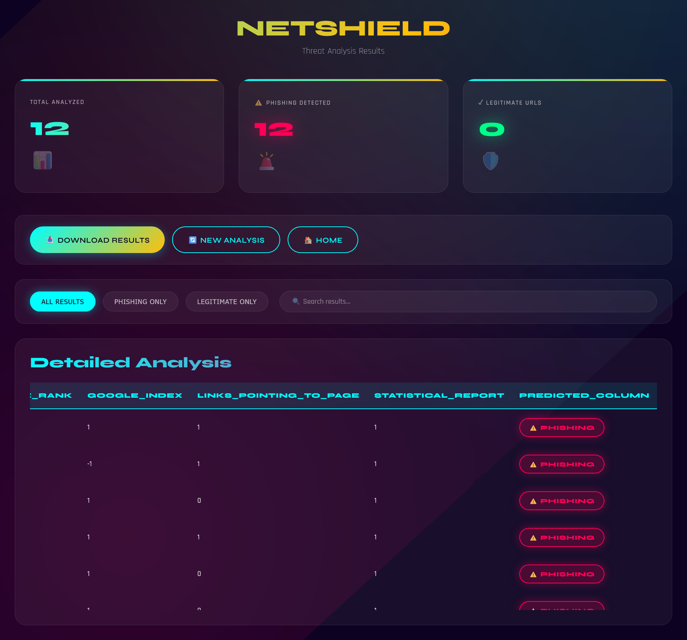
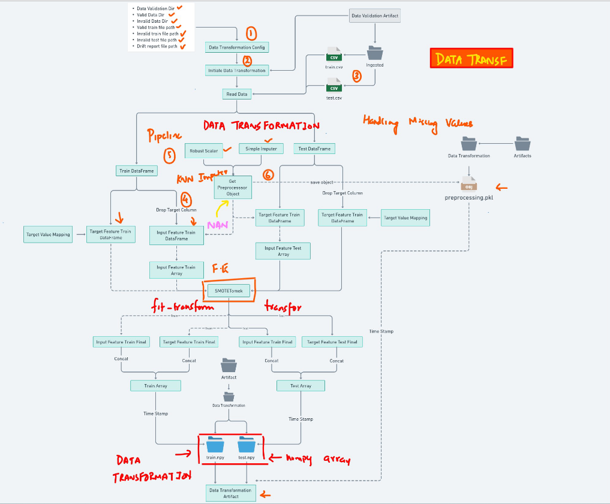
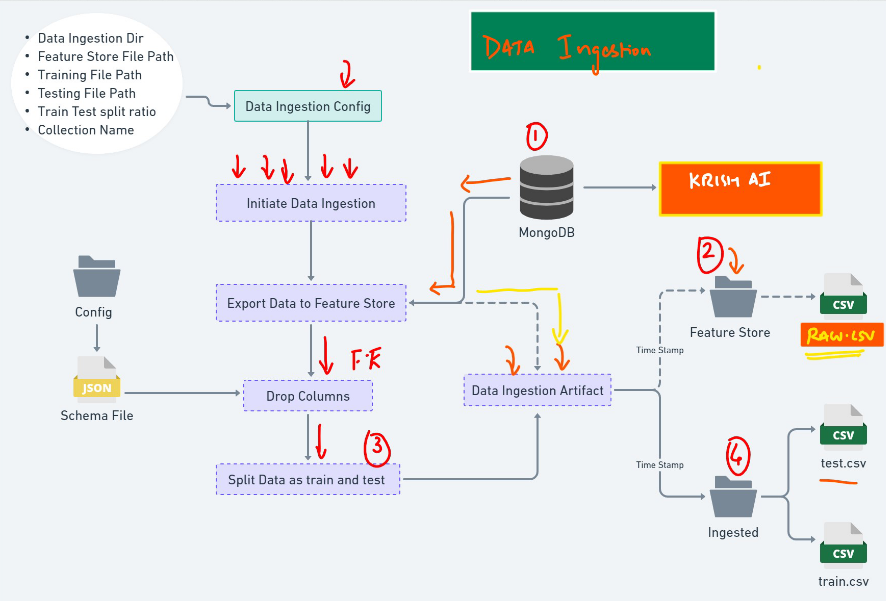
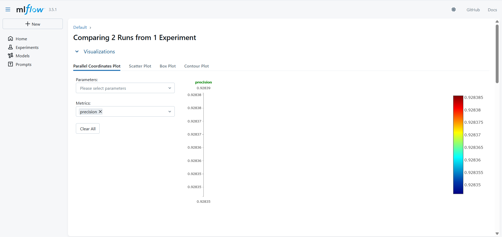

# Network Security - Phishing Detection System

[](https://www.python.org/downloads/)
[](https://opensource.org/licenses/MIT)
[](https://www.docker.com/)

An end-to-end Machine Learning project for detecting phishing attempts in network traffic using advanced ML algorithms, MLflow experiment tracking, and production-ready deployment infrastructure.

---

## 📋 Table of Contents

- [Overview](#overview)
- [Features](#features)
- [Project Architecture](#project-architecture)
- [Technology Stack](#technology-stack)
- [Project Structure](#project-structure)
- [Installation](#installation)
  - [Prerequisites](#prerequisites)
  - [Local Setup](#local-setup)
- [Configuration](#configuration)
- [Usage](#usage)
  - [Training the Model](#training-the-model)
  - [Running Predictions](#running-predictions)
  - [Web Application](#web-application)
- [MLflow Tracking](#mlflow-tracking)
- [API Documentation](#api-documentation)
- [Data Schema](#data-schema)
- [Model Performance](#model-performance)
- [Troubleshooting](#troubleshooting)
- [Contact](#contact)

---
---

## 🎯 Overview

This project implements a comprehensive phishing detection system that analyzes network traffic data to identify potential phishing attempts. The system uses machine learning algorithms trained on network security datasets and provides both batch and real-time prediction capabilities through a web interface.

### Key Objectives:
- **Detect phishing attempts** with high accuracy
- **Automate the ML pipeline** from data ingestion to deployment
- **Track experiments** systematically using MLflow
- **Deploy models** in production-ready environments
- **Ensure data quality** through validation schemas

---

## ✨ Features

- 🔍 **Phishing Detection**: Advanced ML models for identifying phishing attempts
- 📊 **Experiment Tracking**: MLflow integration for comprehensive experiment management
- 🔄 **Automated Pipeline**: End-to-end ML pipeline with data validation
- 🗄️ **MongoDB Integration**: Scalable data storage and retrieval
- 🐳 **Dockerized**: Containerized application for consistent deployments
- 🚀 **CI/CD Pipeline**: Automated testing and deployment with GitHub Actions
- 🌐 **Web Interface**: User-friendly web app for making predictions
- 📈 **Model Monitoring**: Track model performance over time
- ✅ **Data Validation**: Schema-based validation for data quality
- 📦 **Modular Design**: Reusable components and clean architecture

---

## 🏗️ Project Architecture




---

## 🛠️ Technology Stack

### Core Technologies
- **Python 3.8+**: Primary programming language
- **Scikit-learn**: Machine learning algorithms
- **Pandas & NumPy**: Data manipulation and analysis
- **Flask/FastAPI**: Web framework for API and UI

### ML Operations
- **MLflow**: Experiment tracking and model registry
- **MongoDB**: Database for data storage
- **Docker**: Containerization
- **GitHub Actions**: CI/CD automation


---

## 📁 Project Structure

```
networksecurity/
│
├── .github/
│   └── workflows/           # GitHub Actions CI/CD pipelines
│
├── networksecurity/         # Main package directory
│   ├── components/          # Data ingestion, validation, transformation
│   ├── entity/              # Configuration and artifact entities
│   ├── pipeline/            # Training and prediction pipelines
│   ├── utils/               # Utility functions
│   ├── exception/           # Custom exception handling
│   └── logging/             # Logging configuration
│
├── Network_Data/            # Training datasets
├── data_schema/             # Data validation schemas
├── final_model/             # Saved trained models
├── prediction_output/       # Prediction results storage
├── valid_data/              # Validated datasets
├── templates/               # HTML templates for web UI
├── images/                  # Documentation images & diagrams
│
├── app.py                   # Web application entry point
├── main.py                  # Training pipeline orchestrator
├── push_data.py             # MongoDB data upload script
├── test_mongodb.py          # MongoDB connection testing
├── Dockerfile               # Container configuration
├── requirements.txt         # Python dependencies
├── setup.py                 # Package installation
└── README.md               # Project documentation
```

---

## 💻 Installation

### Prerequisites

Before you begin, ensure you have the following installed:
- Python 3.8 or higher
- pip (Python package manager)
- MongoDB (local or cloud instance)
- Docker (optional, for containerized deployment)
- Git

### Local Setup

1. **Clone the repository**
   ```bash
   git clone https://github.com/pinkidagar18/networksecurity.git
   cd networksecurity
   ```

2. **Create a virtual environment**
   ```bash
   # Windows
   python -m venv venv
   venv\Scripts\activate

   # Linux/Mac
   python3 -m venv venv
   source venv/bin/activate
   ```

3. **Install dependencies**
   ```bash
   pip install -r requirements.txt
   ```
---

## ⚙️ Configuration

### MongoDB Configuration

1. **Start MongoDB** (if running locally)
   ```bash
   mongod --dbpath /path/to/data
   ```

2. **Test MongoDB connection**
   ```bash
   python test_mongodb.py
   ```

3. **Upload data to MongoDB**
   ```bash
   python push_data.py
   ```

### MLflow Configuration

MLflow tracking is automatically configured. The tracking database (`mlflow.db`) is created in the project root.

To view the MLflow UI:
```bash
mlflow ui --backend-store-uri sqlite:///mlflow.db
```

Access the UI at: `http://localhost:5000`

---

## 🚀 Usage

### Training the Model

Run the complete training pipeline:

```bash
python main.py
```

This will execute:
1. Data ingestion from MongoDB
2. Data validation against schema
3. Data transformation and feature engineering
4. Model training with multiple algorithms
5. Model evaluation and selection
6. Model registration in MLflow

### Running Predictions

**Batch Predictions:**
```python
from networksecurity.pipeline.prediction_pipeline import PredictionPipeline

pipeline = PredictionPipeline()
predictions = pipeline.predict(input_data)
```

**Single Prediction:**
```python
import pandas as pd
from networksecurity.pipeline.prediction_pipeline import PredictionPipeline

# Prepare input data
data = pd.DataFrame({
    'feature1': [value1],
    'feature2': [value2],
    # ... other features
})

pipeline = PredictionPipeline()
result = pipeline.predict(data)
print(f"Prediction: {result}")
```

### Web Application

Start the web server:

```bash
python app.py
```

Access the application at: `http://localhost:8080`

**Web Interface Features:**
- Upload CSV files for batch predictions
- Single record prediction form
- View prediction history
- Download prediction results

---

## 📊 MLflow Tracking

### Viewing Experiments

```bash
mlflow ui --backend-store-uri sqlite:///mlflow.db
```

### Logged Metrics
- Accuracy
- Precision
- Recall
- F1 Score
- ROC-AUC
- Confusion Matrix

### Logged Parameters
- Algorithm type
- Hyperparameters
- Training data version
- Feature engineering steps

### Logged Artifacts
- Trained models
- Feature importance plots
- Confusion matrices
- Training/validation curves

---


---

## 📖 API Documentation

### Endpoints

#### 1. Health Check
```http
GET /health
```

**Response:**
```json
{
  "status": "healthy",
  "timestamp": "2026-01-20T10:30:00Z"
}
```

#### 2. Single Prediction
```http
POST /predict
Content-Type: application/json
```

**Request Body:**
```json
{
  "features": {
    "feature1": value1,
    "feature2": value2,
    ...
  }
}
```

**Response:**
```json
{
  "prediction": 0,
  "probability": 0.95,
  "is_phishing": false
}
```

#### 3. Batch Prediction
```http
POST /predict_batch
Content-Type: multipart/form-data
```

**Request:**
- Upload CSV file with features

**Response:**
```json
{
  "predictions": [0, 1, 0, ...],
  "count": 100,
  "download_url": "/download/predictions_20260120.csv"
}
```

#### 4. Model Info
```http
GET /model/info
```

**Response:**
```json
{
  "model_version": "1.0.0",
  "algorithm": "RandomForest",
  "accuracy": 0.96,
  "last_trained": "2026-01-15T14:30:00Z"
}
```

---

## 📋 Data Schema

### Input Features

| Feature Name | Type | Description | Required |
|-------------|------|-------------|----------|
| source_ip | string | Source IP address | Yes |
| destination_ip | string | Destination IP address | Yes |
| packet_size | int | Size of the packet in bytes | Yes |
| protocol | string | Network protocol (TCP/UDP/HTTP) | Yes |
| port | int | Port number | Yes |
| timestamp | datetime | Timestamp of the traffic | Yes |
| url_length | int | Length of the URL (if applicable) | No |
| special_chars | int | Count of special characters | No |
| entropy | float | Entropy of the data | No |

### Output Schema

| Field | Type | Description |
|-------|------|-------------|
| prediction | int | 0 (legitimate) or 1 (phishing) |
| probability | float | Confidence score (0-1) |
| is_phishing | boolean | Binary classification result |

---

## 📸 Project Screenshots

### Dagshub Experiment Tracking



### MLflow Experiment Tracking



MLflow UI showing experiment tracking, model metrics, and parameter comparison across different runs.

### Web Application Interface


Main web interface for uploading data and making predictions.


Prediction results page showing classification outcomes and confidence scores.



Batch prediction interface for processing multiple records from CSV files.

### Data Validation 


Data validation dashboard showing schema compliance and data quality metrics.

### Data Transformation



### Data Ingestion



---

## 📈 Model Performance

### Model Comparison



| Algorithm | Accuracy | Training Time | Model Size |
|-----------|----------|---------------|------------|
| Random Forest | 96.5% | 45s | 120 MB |
| XGBoost | 95.8% | 38s | 85 MB |
| Logistic Regression | 89.2% | 12s | 5 MB |
| Neural Network | 94.3% | 180s | 250 MB |

**Selected Model:** Random Forest (best balance of accuracy and performance)

---

## 🔧 Troubleshooting

### Common Issues and Solutions

#### 1. MongoDB Connection Issues

**Problem:** `pymongo.errors.ServerSelectionTimeoutError`

**Solutions:**
```bash
# Check if MongoDB is running
sudo systemctl status mongod

# Start MongoDB
sudo systemctl start mongod

# Verify connection string in .env
MONGO_DB_URL=mongodb://localhost:27017

# Test connection
python test_mongodb.py
```

#### 2. Module Import Errors

**Problem:** `ModuleNotFoundError: No module named 'networksecurity'`

**Solutions:**
```bash
# Reinstall the package in development mode
pip install -e .

# Or add to PYTHONPATH
export PYTHONPATH="${PYTHONPATH}:/path/to/networksecurity"
```

#### 3. MLflow Tracking Issues

**Problem:** MLflow UI not showing experiments

**Solutions:**
```bash
# Check if mlflow.db exists
ls -l mlflow.db

# Restart MLflow UI with correct backend
mlflow ui --backend-store-uri sqlite:///mlflow.db --port 5000

# Clear browser cache and reload
```

#### 4. Memory Issues During Training

**Problem:** `MemoryError` or process killed during training

**Solutions:**
```python
# Reduce batch size in configuration
# In networksecurity/entity/config_entity.py
BATCH_SIZE = 1000  # Reduce from default

# Use data sampling for large datasets
df_sample = df.sample(frac=0.7, random_state=42)

# Increase system swap space (Linux)
sudo fallocate -l 4G /swapfile
sudo chmod 600 /swapfile
sudo mkswap /swapfile
sudo swapon /swapfile
```

#### 5. Data Validation Failures

**Problem:** Data validation errors during pipeline execution

**Solutions:**
```bash
# Check data schema
cat data_schema/schema.yaml

# Validate data manually
python -c "
from networksecurity.components.data_validation import DataValidation
validator = DataValidation()
validator.validate_data('path/to/data.csv')
"

# Review logs
tail -f logs/network_security.log
```

#### 6. Prediction API Errors

**Problem:** 500 Internal Server Error on prediction endpoint

**Solutions:**
```bash
# Check logs
tail -f logs/app.log

# Verify model file exists
ls -l final_model/

# Test prediction locally
python -c "
from networksecurity.pipeline.prediction_pipeline import PredictionPipeline
import pandas as pd
data = pd.read_csv('test_data.csv')
pipeline = PredictionPipeline()
print(pipeline.predict(data))
"
```

#### 7. Feature Engineering Errors

**Problem:** `ValueError` or `KeyError` during feature transformation

**Solutions:**
```python
# Check for missing columns
print(df.columns.tolist())

# Handle missing values
df.fillna(df.mean(), inplace=True)

# Verify feature names match schema
from networksecurity.entity.config_entity import DataTransformationConfig
config = DataTransformationConfig()
print(config.required_features)
```

---

## 📧 Contact

**Project Maintainer:** Pinki Dagar

- **GitHub:** [@pinkidagar18](https://github.com/pinkidagar18)
- **Email:** pinkidagar18@gmail.com

---

## 📚 Additional Resources

- [MLflow Documentation](https://mlflow.org/docs/latest/index.html)
- [Scikit-learn Documentation](https://scikit-learn.org/stable/)
- [MongoDB Documentation](https://docs.mongodb.com/)
- [Docker Documentation](https://docs.docker.com/)
- [AWS Documentation](https://docs.aws.amazon.com/)

---

**⭐ If you find this project useful, please consider giving it a star!**

---

